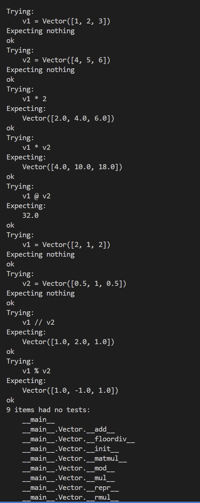
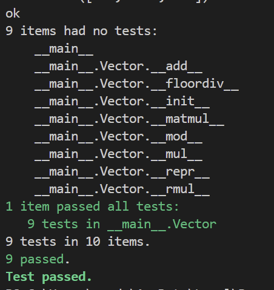

# Tercera tarea de APA: Multiplicación de vectores y ortogonalidad

**Nombre:** Sandra Cots Agüera

---

## Ejecución de los tests unitarios

A continuación se muestra las capturas de pantalla con el resultado de ejecutar el fichero `algebra_vectores.py` con la opción verbosa (`-v`):




---

## Código desarrollado

El siguiente código implementa la clase `Vector` con las sobrecargas de operadores para el producto de Hadamard (`*`), producto escalar (`@`), componente paralela (`//`) y componente normal (`%`).

```python
"""
Trabajo de APA: Multiplicación de vectores y ortogonalidad
Alumno: Sandra Cots Agüera
"""

class Vector:
    """
    Clase para representar vectores y realizar operaciones algebraicas.
    
    >>> v1 = Vector([1, 2, 3])
    >>> v2 = Vector([4, 5, 6])
    >>> v1 * 2
    Vector([2.0, 4.0, 6.0])
    >>> v1 * v2
    Vector([4.0, 10.0, 18.0])
    >>> v1 @ v2
    32.0
    >>> v1 = Vector([2, 1, 2])
    >>> v2 = Vector([0.5, 1, 0.5])
    >>> v1 // v2
    Vector([1.0, 2.0, 1.0])
    >>> v1 % v2
    Vector([1.0, -1.0, 1.0])
    >>> v1 == v1 // v2 + v1 % v2
    True
    """

    def __init__(self, componentes):
        """Inicializa el vector convirtiendo elementos a float."""
        self.vector = [float(x) for x in componentes]

    def __repr__(self):
        """Representación textual del vector."""
        return f"Vector({self.vector})"

    def __mul__(self, other):
        """Producto de Hadamard (vector * vector) o por un escalar."""
        if isinstance(other, (int, float)):
            return Vector([x * other for x in self.vector])
        if isinstance(other, Vector):
            return Vector([a * b for a, b in zip(self.vector, other.vector)])

    def __rmul__(self, other):
        """Permite la multiplicación escalar * vector."""
        return self.__mul__(other)

    def __matmul__(self, other):
        """Producto escalar usando el operador @."""
        return sum(a * b for a, b in zip(self.vector, other.vector))

    def __floordiv__(self, other):
        """Componente paralela (v1 // v2)."""
        denominador = other @ other
        if denominador == 0:
            raise ZeroDivisionError("No se puede proyectar sobre un vector nulo.")
        escalar = (self @ other) / denominador
        return other * escalar

    def __mod__(self, other):
        """Componente normal (v1 % v2)."""
        v_paralelo = self // other
        return Vector([a - b for a, b in zip(self.vector, v_paralelo.vector)])

    def __add__(self, other):
        """Suma de vectores."""
        return Vector([a + b for a, b in zip(self.vector, other.vector)])

    def __eq__(self, other):
        """Compara si dos vectores son iguales (usado en los tests)."""
        return self.vector == other.vector

if __name__ == "__main__":
    import doctest
    doctest.testmod(verbose=True)
